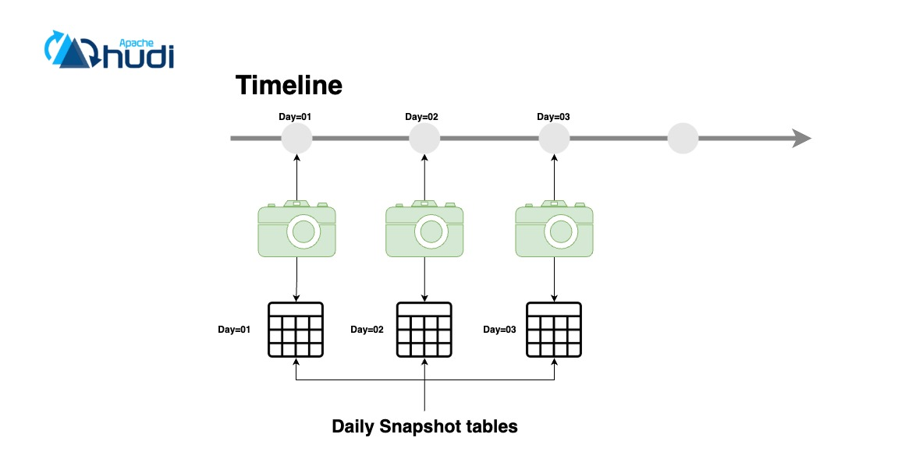
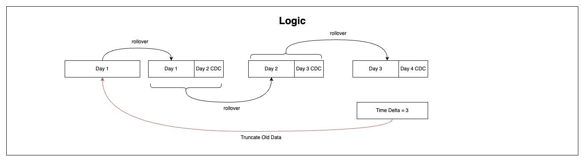
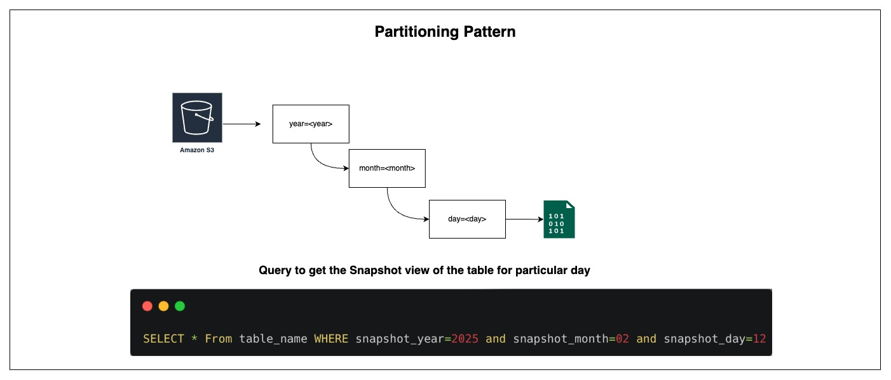
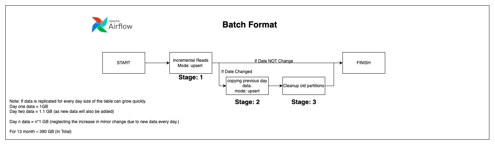
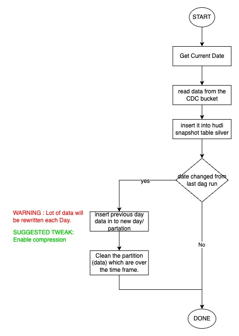

# Daily Hudi Snapshot Pipeline



## 1. Introduction

To provide daily point‑in‑time views of rapidly changing data while still ingesting continuous CDC updates, this pipeline uses Apache Hudi on Amazon S3, orchestrated via Apache Airflow and executed by AWS Glue. Each day, a new snapshot partition is materialized (year → month → day), old snapshots beyond a retention window are purged, and CDC events feed an always‑up‑to‑date bronze table.

---

## 2. Objectives

1. **Continuous CDC ingestion** into a bronze Hudi table (`hudi_lakehouse_ingestion`).
2. **Daily snapshot rollover** by copying "yesterday"’s state into a new partition (`hudi_lakehouse_snapshot_rollover`).
3. **Retention cleanup** of partitions older than 3 days (`hudi_lakehouse_cleaner`).
4. **Expose** the silver snapshots in Athena for fast, partition‐pruned queries.
5. **Idempotent**, cost‑efficient, and automated via Airflow.

---

## 3. Partitioning Pattern

Data is partitioned by:

```
year=<YYYY>/
  month=<MM>/
    day=<DD>/
```

**Athena example query**:

```sql
SELECT *
  FROM silver_table
 WHERE year = 2025
   AND month = 02
   AND day   = 12;
```

---

## 4. End‑to‑End Data Flow

### Stage 1: Bronze Ingestion (`hudi_lakehouse_ingestion`)

* **Trigger**: Frequent schedule (e.g. every 15 min).
* **Operation**: `upsert` (COW table).
* **Record Key**: Business key(s) (e.g. `id`).
* **Precombine Field**: `event_timestamp`.
* **Partition Keys**: `year`, `month`, `day` derived via Spark:

  ```scala
  .withColumn("year",  year(col("event_timestamp")))
  .withColumn("month", month(col("event_timestamp")))
  .withColumn("day",   dayofmonth(col("event_timestamp")))
  ```
* **Result**: Bronze table always reflects the latest CDC.

### Stage 2: Snapshot Rollover (`hudi_lakehouse_snapshot_rollover`)

* **Condition**: `current_date > last_run_date`.
* **Action**:

  1. Read *yesterday*’s bronze partition.
  2. Upsert into silver table under today’s partition (`year`, `month`, `day` = today).
  3. Include any CDC events since midnight.
* **Outcome**: Silver snapshot for the new day.

### Stage 3: Retention Cleanup (`hudi_lakehouse_cleaner`)

* **Retention Window**: 3 days (configurable).
* **Action**: Delete silver partitions older than `current_date - 3`.
* **Glue Job**: Runs immediately after rollover.
* **Outcome**: Storage bounded; Athena scans only recent partitions.

---

## 5. Airflow DAG

* **Schedule**:

  * Bronze ingestion: every 15 min.
  * Snapshot DAG: daily at 00:05.
* **Branching**: PythonOperator compares dates to decide rollover.

---

## 6. Glue Job Configuration Snippets

```yaml
# Ingestion job: hudi_lakehouse_ingestion
--conf hoodie.datasource.write.operation=upsert
--conf hoodie.datasource.write.recordkey.field=id
--conf hoodie.datasource.write.precombine.field=event_timestamp
--conf hoodie.datasource.write.partitionpath.field=year,month,day
--conf hoodie.table.type=COPY_ON_WRITE
--conf hoodie.cleaner.policy=KEEP_LATEST_FILE_VERSIONS
--conf hoodie.cleaner.fileversions.retained=3
```

```yaml
# Snapshot rollover: hudi_lakehouse_snapshot_rollover
# Same as ingestion, but input = previous day’s bronze partition
--conf hoodie.datasource.write.operation=upsert
# writes into today's year/month/day
```

```yaml
# Cleaner job: hudi_lakehouse_cleaner
--conf hoodie.datasource.write.operation=delete
--conf hoodie.datasource.write.partitionpath.field=year,month,day
# delete partitions older than 3 days
```

---

## 7. Monitoring & Alerts

* **Airflow UI**: DAG status, task logs.
* **CloudWatch**:

  * Glue job errors & DPU metrics.
  * S3 storage alarms if growth spikes.
* **Notifications**: SNS or Slack on failures.

---

## 8. Cost & Performance Tips

* **Partition pruning** keeps scans minimal.
* Use **Snappy compression** for Parquet to reduce costs.
* Tune `hoodie.upsert.shuffle.parallelism` for optimal job duration.
* Adjust retention window based on query patterns and budget.

---

## 9. Conclusion

This pipeline ingests CDC into a daily‑partitioned bronze Hudi table, then:

1. **Rolls over** yesterday’s data into a silver partition.
2. **Purges** old snapshots beyond 3 days.
3. **Serves** fresh, partition‑pruned data to Athena.

The result is a lean, automated, time‑travel‑ready snapshot solution aligned with your diagram.
